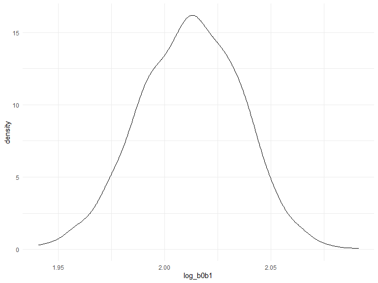

p8105_hw6_hm2900
================

## Problem 1

``` r
weather_df = 
  rnoaa::meteo_pull_monitors(
    c("USW00094728"),
    var = c("PRCP", "TMIN", "TMAX"), 
    date_min = "2017-01-01",
    date_max = "2017-12-31") %>%
  mutate(
    name = recode(id, USW00094728 = "CentralPark_NY"),
    tmin = tmin / 10,
    tmax = tmax / 10) %>%
  select(name, id, everything())
```

    ## Registered S3 method overwritten by 'hoardr':
    ##   method           from
    ##   print.cache_info httr

    ## using cached file: C:\Users\mahen\AppData\Local/Cache/R/noaa_ghcnd/USW00094728.dly

    ## date created (size, mb): 2022-10-11 21:30:48 (8.422)

    ## file min/max dates: 1869-01-01 / 2022-09-30

``` r
weather_df %>% 
  modelr::bootstrap(n = 1000) %>% 
  mutate(
    models = map(strap, ~lm(tmax ~ tmin, data = .x) ),
    results = map(models, broom::glance)) %>% 
  select(-strap, -models) %>% 
  unnest(results) %>% 
  ggplot(aes(x = r.squared)) + geom_density()
```


``` r
weather_df %>% 
  modelr::bootstrap(n = 1000) %>% 
  mutate(
    models = map(strap, ~lm(tmax ~ tmin, data = .x) ),
    results = map(models, broom::tidy)) %>% 
  select(-strap, -models) %>% 
  unnest(results) %>% 
  select(id = `.id`, term, estimate) %>% 
  pivot_wider(
    names_from = term, 
    values_from = estimate) %>% 
  rename(beta0 = `(Intercept)`, beta1 = tmin) %>% 
  mutate(log_b0b1 = log(beta0 * beta1)) %>% 
  ggplot(aes(x = log_b0b1)) + geom_density()
```



## Problem 2

Load the dataset

``` r
homicides_df = read_csv("./data/homicide-data.csv")

homicides_new = 
  homicides_df %>% 
  janitor::clean_names() %>% 
  mutate(city_state = str_c(city, state, sep = "_")) %>% 
  filter(!city_state %in% c("Dallas_TX", "Phoenix_AZ", "Kansas City_MO", "Tulsa_AL"), victim_race %in% c("Black", "White")) %>% 
  mutate(
    victim_age = as.numeric(victim_age),
    resolved = as.numeric(disposition == "Closed by arrest"),
    victim_race = fct_relevel(victim_race, "White"),
    victim_sex = fct_relevel(victim_sex, "Female"))
```

For the city of Baltimore, MD, use the glm function to fit a logistic
regression with resolved vs unresolved as the outcome and victim age,
sex and race as predictors.

``` r
baltimore_glm = 
  homicides_new %>% 
  filter(city_state == "Baltimore_MD") %>% 
  glm(resolved ~ victim_age + victim_sex + victim_race, family = binomial(), data = .) %>% 
  broom::tidy()

baltimore_glm
```

    ## # A tibble: 4 × 5
    ##   term             estimate std.error statistic  p.value
    ##   <chr>               <dbl>     <dbl>     <dbl>    <dbl>
    ## 1 (Intercept)       1.15      0.237        4.87 1.14e- 6
    ## 2 victim_age       -0.00673   0.00332     -2.02 4.30e- 2
    ## 3 victim_sexMale   -0.854     0.138       -6.18 6.26e-10
    ## 4 victim_raceBlack -0.842     0.175       -4.82 1.45e- 6

Now run glm for each of the cities in your dataset, and extract the
adjusted odds ratio (and CI) for solving homicides comparing male
victims to female victims.

``` r
all_glm = 
  homicides_new %>% 
  nest(all_cities = -city_state) %>%
  mutate(
    models = map(.x = all_cities, ~glm(resolved ~ victim_age + victim_sex + victim_race, family = binomial(), data = .)),
    results = map(models, broom::tidy)) %>% 
  select(-models, -all_cities) %>% 
  unnest(cols = results) %>% 
  mutate(
    OR = exp(estimate),
    CI_lower = exp(estimate - 1.96 * std.error),
    CI_upper = exp(estimate + 1.96 * std.error)) %>% 
  filter(term == "victim_sexMale") %>% 
  select(city_state, OR, CI_lower, CI_upper)

all_glm %>% 
  knitr::kable(digits = 3)
```

| city_state        |    OR | CI_lower | CI_upper |
|:------------------|------:|---------:|---------:|
| Albuquerque_NM    | 1.767 |    0.831 |    3.761 |
| Atlanta_GA        | 1.000 |    0.684 |    1.463 |
| Baltimore_MD      | 0.426 |    0.325 |    0.558 |
| Baton Rouge_LA    | 0.381 |    0.209 |    0.695 |
| Birmingham_AL     | 0.870 |    0.574 |    1.318 |
| Boston_MA         | 0.674 |    0.356 |    1.276 |
| Buffalo_NY        | 0.521 |    0.290 |    0.935 |
| Charlotte_NC      | 0.884 |    0.557 |    1.403 |
| Chicago_IL        | 0.410 |    0.336 |    0.501 |
| Cincinnati_OH     | 0.400 |    0.236 |    0.677 |
| Columbus_OH       | 0.532 |    0.378 |    0.750 |
| Denver_CO         | 0.479 |    0.236 |    0.971 |
| Detroit_MI        | 0.582 |    0.462 |    0.734 |
| Durham_NC         | 0.812 |    0.392 |    1.683 |
| Fort Worth_TX     | 0.669 |    0.397 |    1.127 |
| Fresno_CA         | 1.335 |    0.580 |    3.071 |
| Houston_TX        | 0.711 |    0.558 |    0.907 |
| Indianapolis_IN   | 0.919 |    0.679 |    1.242 |
| Jacksonville_FL   | 0.720 |    0.537 |    0.966 |
| Las Vegas_NV      | 0.837 |    0.608 |    1.154 |
| Long Beach_CA     | 0.410 |    0.156 |    1.082 |
| Los Angeles_CA    | 0.662 |    0.458 |    0.956 |
| Louisville_KY     | 0.491 |    0.305 |    0.790 |
| Memphis_TN        | 0.723 |    0.529 |    0.988 |
| Miami_FL          | 0.515 |    0.304 |    0.872 |
| Milwaukee_wI      | 0.727 |    0.499 |    1.060 |
| Minneapolis_MN    | 0.947 |    0.478 |    1.875 |
| Nashville_TN      | 1.034 |    0.685 |    1.562 |
| New Orleans_LA    | 0.585 |    0.422 |    0.811 |
| New York_NY       | 0.262 |    0.138 |    0.499 |
| Oakland_CA        | 0.563 |    0.365 |    0.868 |
| Oklahoma City_OK  | 0.974 |    0.624 |    1.520 |
| Omaha_NE          | 0.382 |    0.203 |    0.721 |
| Philadelphia_PA   | 0.496 |    0.378 |    0.652 |
| Pittsburgh_PA     | 0.431 |    0.265 |    0.700 |
| Richmond_VA       | 1.006 |    0.498 |    2.033 |
| San Antonio_TX    | 0.705 |    0.398 |    1.249 |
| Sacramento_CA     | 0.669 |    0.335 |    1.337 |
| Savannah_GA       | 0.867 |    0.422 |    1.780 |
| San Bernardino_CA | 0.500 |    0.171 |    1.462 |
| San Diego_CA      | 0.413 |    0.200 |    0.855 |
| San Francisco_CA  | 0.608 |    0.317 |    1.165 |
| St. Louis_MO      | 0.703 |    0.530 |    0.932 |
| Stockton_CA       | 1.352 |    0.621 |    2.942 |
| Tampa_FL          | 0.808 |    0.348 |    1.876 |
| Tulsa_OK          | 0.976 |    0.614 |    1.552 |
| Washington_DC     | 0.690 |    0.468 |    1.017 |

Create a plot that shows the estimated ORs and CIs for each city.
Organize cities according to estimated OR, and comment on the plot.

``` r
orci_plot = 
  all_glm %>% 
  mutate(city_state = fct_reorder(city_state, OR)) %>% 
  ggplot(aes(x = city_state, y = OR)) +
  geom_point() +
  ylim(0, 4) +
  geom_errorbar(aes(ymin = CI_lower, ymax = CI_upper)) + 
  theme(axis.text.x = element_text(angle = 90, vjust = 0.5, hjust = 1))

orci_plot
```


Based on the plot, we can see that New York has the lowest adjusted odds
ratio and Albuquerque has the highest adjusted odds ratio. Meanwhile,
most of adjusted odds ratios are below 1, which indicates that the odds
of having a resolved homicide among male victims is lower than the odds
of having a resolved homicide among female victims in those cities.
Except a few cities have much higher adjusted odds ratios, their CIs
also have a much wider range than others’.
